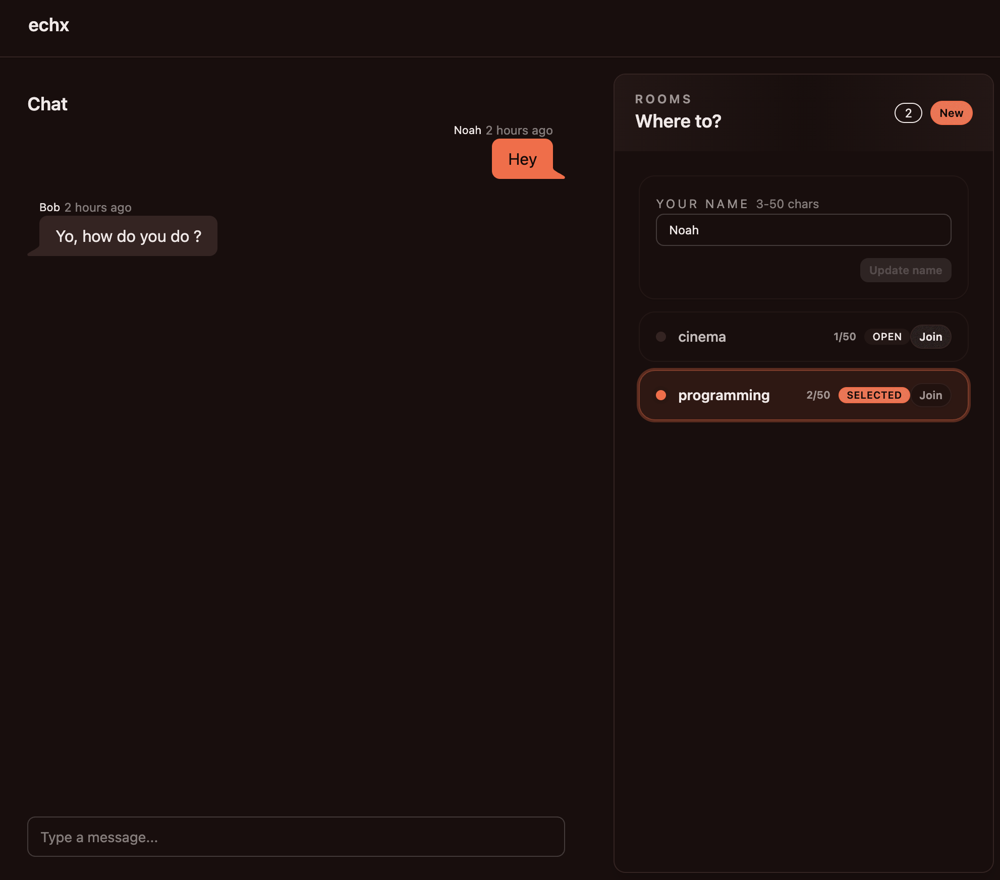

# echx


A tiny WebSocket chat app I built to learn Gleam. It’s intentionally small and simple—more of a toy project than a production system.

## Screenshot



## What’s inside

- Gleam backend using `mist` and a small message pipeline
- React + Vite frontend (Tailwind + DaisyUI)
- WebSocket-only transport (`/ws`)

## Quick start

### Backend

```sh
cd backend
gleam run
```

The backend listens on `http://localhost:8080`.

### Frontend

```sh
cd frontend
pnpm install
pnpm dev
```

The frontend will point at the local backend (via WebSocket).

## Notes

- This repo is a learning project, so expect rough edges.
- There’s a `compose.yml` for the deployed images, but it’s not required for local dev.

## Why this exists

I wanted a small, real-world-ish project to understand Gleam’s syntax, tooling, and OTP-style processes. That’s it—no grand ambitions.
